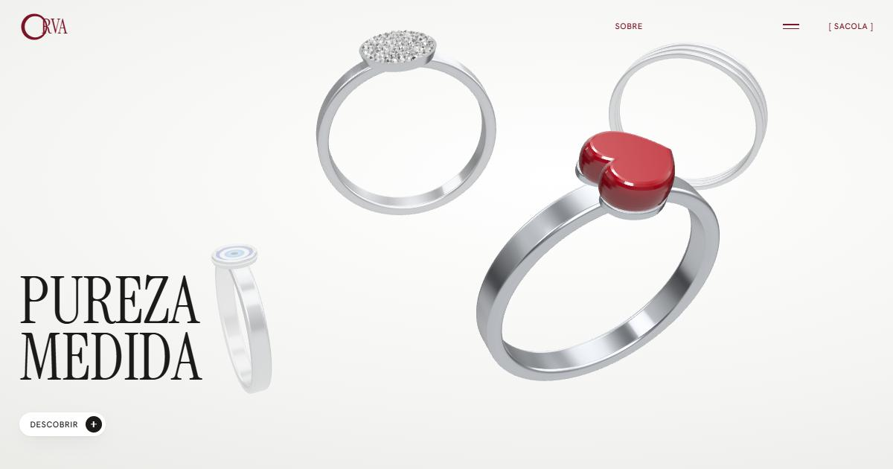

# ORVA Premium

Site de uma joalheria fictícia de anéis de prata, construído para estudar **coreografia de rolagem**: seções que ficam paradas na tela enquanto a cena muda, em vez de a página simplesmente descer.

A dinâmica foi inspirada no site de joias OYLA. Marca, textos, produtos e visuais são originais e fictícios: no lugar de fotos e vídeos, os anéis e a água são gerados por código em 3D (Three.js).



## Efeitos

| Efeito | Técnica | Onde |
|---|---|---|
| Rolagem suave | Lenis suaviza a rolagem e avisa o ScrollTrigger a cada quadro | `js/main.js`, etapa 1 |
| Título se desfaz letra por letra | O título é quebrado em letras; a seção fica fixa (`pin`) e a animação acompanha a rolagem (`scrub`): opacidade e `blur` com `stagger` | `js/main.js`, etapas 2 e 3 |
| Mídia do hero sobe mais devagar | Parallax com `yPercent` enquanto a próxima seção sobe | `js/main.js`, etapa 3 |
| Produtos andam para o lado | Seção fixada; a trilha recebe `x = -(largura total - largura da tela)` | `js/main.js`, etapa 4 |
| Faixa que abre no meio e vira tela cheia | `clip-path: inset(0 50% 0 50%)` → `inset(0)` na mesma timeline da trilha | `js/main.js`, etapas 4 e 5 |
| Coluna esquerda parada enquanto a direita rola | `position: sticky` | `css/style.css`, seção 4 |
| Cabeçalho de vidro fosco | Classe `is-solid` com `backdrop-filter` ao sair do hero | `js/main.js` + `css/style.css` |
| Anéis e água em 3D | Three.js com iluminação de estúdio; água com cáusticas em shader | `js/rings.js`, `js/water.js` |

Também tem menu em tela cheia, sacola lateral, contadores, newsletter com validação e um modo sem animação para quem ativa "reduzir movimento" no sistema. Sacola e newsletter são demonstrações: nada é vendido nem registrado.

### O padrão principal: `pin` + `scrub`

```js
gsap.timeline({
  scrollTrigger: {
    trigger: '.collection', // seção observada
    start: 'top top',       // começa quando o topo da seção encosta no topo da tela
    end: '+=2000',          // dura 2000 px de rolagem
    pin: true,              // segura a seção na tela durante esse trecho
    scrub: true,            // progresso da animação = progresso da rolagem
  },
})
  .to(trilha, { x: -distancia })                          // 1º: anda para o lado
  .fromTo(painel, { clipPath: 'inset(0% 50% 0% 50%)' },   // 2º: abre do centro
                  { clipPath: 'inset(0% 0% 0% 0%)' });
```

## Como rodar

Os scripts são módulos ES, então a página precisa de um servidor. Abrir o `index.html` com dois cliques não carrega as animações.

```bash
npm run dev
```

Ou, sem Node:

```bash
python -m http.server 5173
```

Depois acesse http://localhost:5173.

## Estrutura

```
index.html      marcação de todas as seções
css/style.css   visual, layout e responsivo
js/main.js      dinâmica de rolagem e interações
js/rings.js     anéis 3D (hero e fotos dos produtos)
js/water.js     água com cáusticas (seção de revelação)
assets/         vídeos reais, se houver (opcional)
```

Sem etapa de build. As bibliotecas vêm por CDN com versão fixa: GSAP 3.12.5 + ScrollTrigger, Lenis 1.1.13 e Three.js 0.169.0. As fontes são Instrument Serif e Hanken Grotesk (Google Fonts).

## Usar vídeos no lugar do 3D

No `index.html`, preencha o `data-src` dos vídeos:

```html
<video class="hero__video" data-src="assets/hero.mp4" ...>
<video class="reveal__video" data-src="assets/agua.mp4" ...>
```

Para uma versão vertical no celular, acrescente `data-src-mobile="assets/hero-mobile.mp4"`. Quando o vídeo carrega, a cena 3D daquela seção nem é criada. Use MP4 (H.264), sem áudio, com até 6 MB e loop curto (5 a 10 s).
